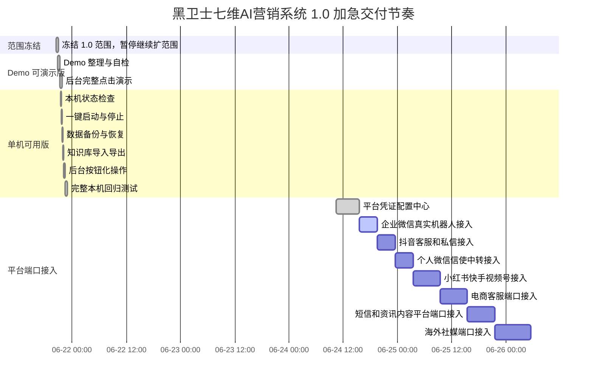

# 黑卫士七维AI营销系统项目进度看板

最近更新时间：2026-06-26

现在执行加急冲刺节奏：不再继续扩大 1.0 范围，先把黑卫士七维AI营销系统做到可安装、可演示、可本机稳定使用。后续每做完一步，就更新这张看板。

## 状态说明

```text
✅ 已完成
🟡 进行中
⬜ 待开始
⛔ 暂停/阻塞
```

## 当前状态

| 项目 | 当前结论 |
| --- | --- |
| 当前阶段 | ✅ 黑卫士七维AI营销系统 1.0 单机可演示版已完成第一批能力 |
| 已完成重点 | ✅ Demo 可演示版；✅ 本机状态检查；✅ 一键启动/停止；✅ 备份恢复；✅ 知识库导入导出；✅ 知识库导入模板；✅ 私信审批队列；✅ 后台按钮化；✅ 平台凭证配置中心；✅ 企业微信真实接入检查面板；✅ 标题进度百分比与倒计时；✅ 自动私信生成器/客户生命周期/转化剧本/Hermes 双向中心/并行任务调度展示口径 |
| 下一步 | 补齐企业微信机器人 ID、Secret 和知识库接口密钥后，做真实群内 @ 收发验证；企业微信稳定后按抖音第二、个人微信第三推进 |
| 暂停事项 | ⛔ 暂停继续扩范围；采集板块资料只进候选池，正式吸收前必须先确认 |
| 更新规则 | 每完成一步就更新看板；正常推进时每 4 小时汇报一次进度 |

## 4 小时进度汇报规则

| 规则 | 当前做法 |
| --- | --- |
| 汇报频率 | 正常冲刺期间，每 4 小时同步一次 |
| 汇报内容 | 已完成什么、正在做什么、每个模块还剩多少小时、有没有被凭证或权限卡住 |
| 更新时间点 | 每完成一步立即更新看板；如果 4 小时内没有完成大节点，也要同步一次当前状态 |
| 面向谁 | 用非技术语言说明，让不看代码的人也能知道项目走到哪一步 |
| 异常情况 | 如果遇到账号权限、平台审核、凭证缺失等外部阻塞，要标成红色或暂停状态 |

## 加急甘特图



## 阶段进度表

| 序号 | 阶段 | 状态 | 压缩目标 | 交付物 |
| --- | --- | --- | --- | --- |
| 0 | 需求冻结 | ✅ 已完成 | 立即停止扩新模块 | 1.0 范围确定 |
| 1 | Demo 可安装/可演示版 | ✅ 已完成 | 已能打开后台并完整演示 | README、演示脚本、Demo 检查 |
| 2 | 单机可用版命令工具 | ✅ 已完成 | 今天先把本机能跑、能查、能备份 | local 命令、本机操作模块、测试 |
| 3 | 单机可用版后台按钮 | ✅ 已完成 | 把命令能力做进后台页面 | 点按钮看状态、备份、导出 |
| 4 | 完整回归测试 | ✅ 已完成 | 全部测试通过，再进入平台接入 | npm test、demo:check |
| 5 | 平台凭证配置中心 | ✅ 已完成 | 先把所有平台接入资料集中管理 | 后台配置中心、脱敏保存、安全测试 |
| 6 | 企业微信真实接入 | 🟡 进行中 | 第一优先级，先打通真实收发 | 接入检查面板已上线；等待企业微信机器人 ID、Secret 和知识库接口密钥 |
| 7 | 抖音客服/私信接入 | ⬜ 待开始 | 第二优先级，企业微信稳定后接入 | 抖音客服、私信和线索互动 |
| 8 | 个人微信接入 | ⬜ 待开始 | 第三优先级，默认人工确认 | EasyClaw/本地信使中转 |
| 9 | 内容平台后续接入 | ⬜ 待开始 | 小红书、快手、视频号逐个接 | 内容平台客服/私信端口 |
| 10 | 电商客服后续接入 | ⬜ 待开始 | 平台内承接优先 | 淘宝、拼多多、京东等客服端口 |
| 11 | 短信和资讯内容平台 | ⬜ 待开始 | 用户授权和平台权限先行 | 短信、头条号、百家号、B站、知乎 |
| 12 | 海外社媒端口 | ⬜ 待开始 | 跨境平台政策先行 | LinkedIn、Facebook、WhatsApp、X/Twitter、TikTok |

## 单机可用版任务清单

| 任务 | 状态 | 已交付内容 |
| --- | --- | --- |
| 查看本机状态 | ✅ 已完成 | `npm run local:status`、`查看本机状态.command` |
| 一键启动后台 | ✅ 已完成 | `npm run local:start`、`启动后台.command` |
| 一键停止后台 | ✅ 已完成 | `npm run local:stop`、`停止后台.command` |
| 数据备份 | ✅ 已完成 | `npm run local:backup`、`备份数据.command` |
| 数据恢复 | ✅ 已完成 | `npm run local:restore` |
| 知识库导入 | ✅ 已完成 | `npm run local:import -- ./知识库.json` |
| 知识库导出 | ✅ 已完成 | `npm run local:export`、`导出知识库.command` |
| 后台按钮化 | ✅ 已完成 | 后台已支持状态检查、数据备份、知识库导出和知识库导入模板 |
| 平台凭证配置中心 | ✅ 已完成 | 后台可集中填写各平台凭证；接口和页面只显示配置状态，不回显密钥 |
| 企业微信真实接入检查 | ✅ 已完成 | AI客服页新增企业微信接入检查面板，显示缺少凭证、启动动作、测试群验证和安全边界；不回显密钥明文 |
| 私信审批队列 | ✅ 已完成 | 生成私信后可加入待审，支持通过、拒绝、已发送和归档 |
| 演示数据清理 | ⬜ 待开始 | 做成一键清理演示痕迹 |

## 黑卫士七维AI营销系统模块覆盖

| 模块 | 当前状态 | 说明 |
| --- | --- | --- |
| 七维总看板 | ✅ 1.0 可演示 | 展示内容观察、内容生成、矩阵分发、评论私信分级、自动私信、客服承接和成交跟进 |
| 自动私信生成器 | ✅ 1.0 可演示 | 根据平台、地域、作品/账号位置、留言、情绪、需求对象、核验入口和资料权益生成一次性私信建议，并展示来源追踪、发送判断、信号判断、知识库路由/知识库方向、核验清单、邀约目标和邀约决策，生成后进入私信审批队列，默认人工确认 |
| 私信审批队列 | ✅ 1.0 可演示 | 私信不自动发送，先入队列，人工标记通过、拒绝、已发送或归档 |
| 客户生命周期 | ✅ 1.0 可演示 | 用陌生、已互动、已咨询、高意向、待成交、已成交、复购维护等阶段说明客户状态 |
| 私信/评论转化剧本 | ✅ 1.0 可演示 | 把评论、私信、资料领取、报价、案例等场景整理成跟进流程 |
| Hermes 指令收件箱 / 双向中心 | ✅ 1.0 前端可演示 | 同时展示“用户发给 Codex 的指令”和“Codex 回传给用户的阻塞/进度指令”；表单已带 `direction`、`type`、`target`、`moduleId`、`taskId` 字段，默认只入箱不执行 |
| 并行任务调度 | ✅ 1.0 前端可演示 | 新增面板展示 `/api/orchestration-plan` 的工作流、子任务、合并关口和 Hermes 回传策略；平台并行线已展示 20 个端口任务池 |
| 真实平台凭证 | 🟡 可填写，待提供 | 后台平台凭证配置中心已上线；企业微信、抖音、个人微信、内容平台、电商、短信和海外社媒仍需要管理员授权、账号权限和真实凭证 |

## 今日冲刺节奏

| 顺序 | 工作重点 | 验收方式 | 状态 |
| --- | --- | --- | --- |
| 1 | 单机命令工具 | 命令可执行，测试通过 | ✅ 已完成 |
| 2 | 后台按钮化 | 页面上能直接点状态、备份、导出 | ✅ 已完成 |
| 3 | 本机完整回归 | `npm run demo:check` 和 `npm test` 全通过 | ✅ 已完成 |
| 4 | 平台凭证配置中心 | 凭证缺什么、怎么填，后台直接提示 | ✅ 已完成 |
| 5 | 企业微信真实接入准备 | 检查面板可看缺什么；填完企业微信凭证后做真实收发验证 | 🟡 进行中 |

## 平台接入路线图

| 优先级 | 平台 | 当前状态 | 说明 |
| --- | --- | --- | --- |
| 1 | 企业微信 | 🟡 进行中 | 接入检查面板已上线；当前缺企业微信机器人 ID、Secret 和知识库接口密钥，补齐后做群内 @ 验证 |
| 2 | 抖音 | ⬜ 待开始 | 企业微信稳定后，再接客服、私信和线索互动 |
| 3 | 个人微信 | ⬜ 待开始 | 通过 EasyClaw/本地信使中转，默认人工确认，避免误发 |
| 4 | 小红书 | ⬜ 待开始 | 后续内容平台批次，先看官方权限和账号条件 |
| 5 | 快手 | ⬜ 待开始 | 后续内容平台批次，跟小红书、视频号分开接 |
| 6 | 视频号 | ⬜ 待开始 | 后续内容平台批次，优先平台内合规承接 |
| 7 | 电商平台 | ⬜ 待开始 | 淘宝、拼多多、京东等排在后续，默认只做平台内客服承接 |
| 8 | 短信 | ⬜ 待开始 | 需要用户授权、退订和频控机制 |
| 9 | 资讯/社区内容平台 | ⬜ 待开始 | 头条号、百家号、B站、知乎，先确认账号消息权限 |
| 10 | 海外社媒 | ⬜ 待开始 | LinkedIn、Facebook、WhatsApp、X/Twitter、TikTok，先确认跨境平台政策 |

## 标题进度与倒计时规则

| 显示 | 含义 | 状态 |
| --- | --- | --- |
| 蓝色跳动百分比 | 正常推进，按计划开发 | ✅ 已上线 |
| 红色百分比 | 暂停或被凭证、权限、外部条件阻塞 | ✅ 已上线 |
| 绿色百分比 | 超前、提前完成或开发非常顺利 | ✅ 已上线 |
| 小时倒计时 | 每个模块剩余工作量，以小时为单位显示，例如还剩 4 小时、6 小时 | ✅ 已上线 |
| 一位小数百分比 | 例如 `99.9%`，用于快速扫一眼判断进度 | ✅ 已上线 |

## 采集板块控制规则

| 规则 | 状态 | 说明 |
| --- | --- | --- |
| 采集平台先入候选池 | ✅ 生效 | 抖音、快手、小红书、视频号、百度、百家号、头条号先记录，不直接开发 |
| 候选池只是参考资料 | ✅ 生效 | 候选池内容只用于以后判断方向，未经确认不并入开发主线 |
| 正式吸收前必须确认 | ✅ 生效 | 我必须先说明原因、影响范围和耗时，等你确认后再加入 |
| 不影响当前主线 | ✅ 生效 | 当前仍按企业微信第一、抖音第二、个人微信第三推进 |
| 候选池文档 | ✅ 已建立 | 见 `docs/采集候选池.md` |

## 更新记录

| 时间 | 更新内容 | 状态 |
| --- | --- | --- |
| 2026-06-21 21:33 | 看板改成加急冲刺节奏 | ✅ 已完成 |
| 2026-06-21 21:33 | 新增本机状态、启动停止、备份恢复、知识库导入导出工具 | ✅ 已完成 |
| 2026-06-21 21:33 | README 增加单机加急工具入口 | ✅ 已完成 |
| 2026-06-21 21:44 | 后台增加本机工具按钮，支持状态检查、备份和知识库导出 | ✅ 已完成 |
| 2026-06-21 21:44 | 实际执行一次数据备份和知识库导出验证 | ✅ 已完成 |
| 2026-06-21 21:45 | `npm run demo:check` 通过，`npm test` 66 项全部通过 | ✅ 已完成 |
| 2026-06-22 | 建立采集候选池规则：所有采集资料正式吸收前必须先确认 | ✅ 已完成 |
| 2026-06-22 | 用户提供的抖音获客自动化流程图已整理进采集候选池，未进入开发主线 | ✅ 已完成 |
| 2026-06-22 | 用户补充的抖音 SOP 四层架构已加入采集候选池，未进入开发主线 | ✅ 已完成 |
| 2026-06-23 | 后台标题增加模块倒计时和一位小数进度百分比，支持蓝/红/绿状态 | ✅ 已完成 |
| 2026-06-23 | 修复本机一键启动后台日志句柄问题，`npm run local:start` 已验证通过 | ✅ 已完成 |
| 2026-06-23 | 页面渲染验证通过：后台显示 9 个模块进度徽章 | ✅ 已完成 |
| 2026-06-23 | 补充 4 小时进度汇报、模块小时倒计时、平台接入顺序和采集候选池边界 | ✅ 已完成 |
| 2026-06-23 | 文档统一为黑卫士七维AI营销系统，补齐自动私信生成器、客户生命周期、私信/评论转化剧本和 Hermes 指令收件箱口径 | ✅ 已完成 |
| 2026-06-23 | 自动私信生成器补齐作品/账号位置、来源追踪、发送判断、知识库路由/知识库方向、核验清单、邀约目标和邀约决策 | ✅ 已完成 |
| 2026-06-23 | 前端把 Hermes 指令收件箱升级为双向中心，并新增并行任务调度展示面板 | ✅ 已完成 |
| 2026-06-23 | 端口模拟器和并行任务调度补齐 20 个平台端口：企业微信、抖音、个人微信、小程序、快手、小红书、视频号、电商、短信、资讯平台和海外社媒 | ✅ 已完成 |
| 2026-06-24 | 补齐私信审批队列、知识库导入模板按钮和演示检查，生成话术默认先入人工审核 | ✅ 已完成 |
| 2026-06-24 | 新增平台凭证配置中心，支持企业微信、抖音、个人微信、内容平台、电商、短信和海外社媒本机配置；页面和接口不回显密钥明文 | ✅ 已完成 |
| 2026-06-26 | 新增企业微信真实接入检查面板和 `/api/wecom/readiness` 诊断接口，明确缺少凭证、启动命令、测试群验证和安全边界；`npm test` 124 项通过 | ✅ 已完成 |
